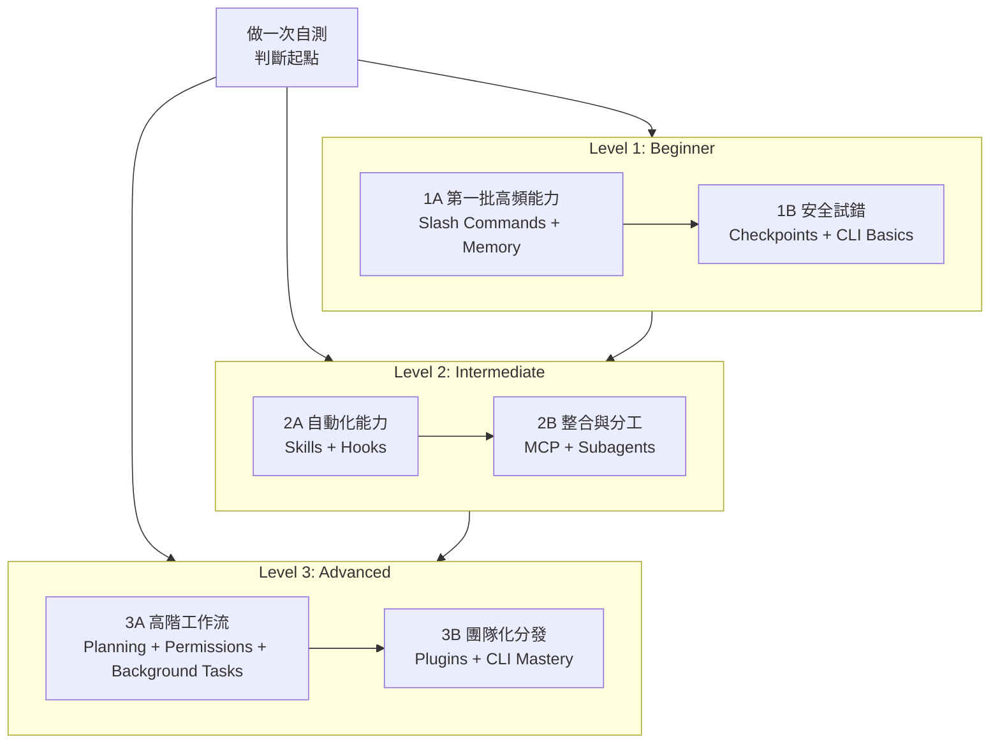

<picture>
  <source media="(prefers-color-scheme: dark)" srcset="resources/logos/claude-howto-logo-dark.svg">
  
</picture>

# Claude Code 學習路線圖

如果你剛接觸 Claude Code，這份路線圖的目標不是讓你一次看完全部功能，而是幫你判斷：

- 你現在在哪個階段
- 應該先學什麼
- 哪些內容值得今天就開始動手
- 哪些能力適合等基礎打穩後再學

---

## 🧭 先判斷你的起點

先快速勾選下面這些專案：

- [ ] 我會啟動 Claude Code，並能正常對話（`claude`）
- [ ] 我建立過或修改過 `CLAUDE.md`
- [ ] 我用過至少 3 個內建 slash commands（例如 `/help`、`/clear`、`/model`）
- [ ] 我建立過自定義 slash command 或 skill（`SKILL.md`）
- [ ] 我設定過一個 MCP server
- [ ] 我在 `~/.claude/settings.json` 裡設定過 hooks
- [ ] 我用過或建立過 subagents（`.claude/agents/`）
- [ ] 我用過 print mode（`claude -p`）做腳本或 CI/CD

### 你的推薦起點

| 勾選數 | 你現在的階段 | 從哪裡開始 | 預計時間 |
|--------|--------------|------------|----------|
| 0-2 | Level 1：Beginner | [里程碑 1A](#里程碑-1a第一批高頻能力) | 約 3 小時 |
| 3-5 | Level 2：Intermediate | [里程碑 2A](#里程碑-2a自動化能力) | 約 5 小時 |
| 6-8 | Level 3：Advanced | [里程碑 3A](#里程碑-3a高階工作流) | 約 5 小時 |

如果你不確定，就從更低一級開始。Claude Code 的很多高階能力都建立在目錄結構、上下文載入和工具許可權這些基礎之上。

如果你已經把 `.claude/skills/self-assessment` 安裝到 Claude Code，也可以直接執行 `/self-assessment` 做互動式自測。

---

## 🎯 學習原則

本倉庫推薦的學習順序，不是按“功能列表”排的，而是按以下原則排的：

1. **先學最常用的能力**
2. **先學依賴更少的能力**
3. **先學能立刻給你回報的能力**

也就是說，你不需要一上來就學 MCP、plugins 或 agent teams。先把 slash commands、memory、CLI、checkpoints 這些基本功打穩，後面會輕鬆很多。

---

## 🗺️ 推薦學習路徑



---

## 📊 完整路線總表

| 順序 | 模組 | 推薦階段 | 時間 | 你學完會得到什麼 |
|------|------|----------|------|------------------|
| 1 | [Slash Commands](01-slash-commands/) | Beginner | 30 分鐘 | 立即獲得一些高頻快捷操作 |
| 2 | [Memory](02-memory/) | Beginner | 45 分鐘 | 學會讓 Claude 記住專案規則和個人偏好 |
| 3 | [Checkpoints](08-checkpoints/) | Beginner+ | 45 分鐘 | 敢於試錯，知道怎麼安全回退 |
| 4 | [CLI Basics](10-cli/) | Beginner+ | 30 分鐘 | 會用 `claude` 和 `claude -p` 處理腳本與終端場景 |
| 5 | [Skills](03-skills/) | Intermediate | 1 小時 | 學會把常見工作流做成可複用能力 |
| 6 | [Hooks](06-hooks/) | Intermediate | 1 小時 | 學會做自動檢查、自動提醒、自動攔截 |
| 7 | [MCP](05-mcp/) | Intermediate+ | 1 小時 | 學會讓 Claude 接 GitHub、資料庫、檔案系統等外部能力 |
| 8 | [Subagents](04-subagents/) | Intermediate+ | 1.5 小時 | 學會任務拆分和專業分工 |
| 9 | [Advanced Features](09-advanced-features/) | Advanced | 2-3 小時 | 掌握 plan、許可權模式、background tasks 等高階能力 |
| 10 | [Plugins](07-plugins/) | Advanced | 2 小時 | 學會把 commands / hooks / MCP / subagents 打包成一套方案 |
| 11 | [CLI Mastery](10-cli/) | Advanced | 1 小時 | 會做自動化、腳本化、CI/CD 整合 |

**總學習時間**：約 11-13 小時。  
如果你不是從零開始，可以直接跳到適合自己的階段。

---

## 🟢 里程碑 1A：第一批高頻能力

**適合誰**：幾乎沒用過 Claude Code，或者只會聊天  
**目標**：先取得最快的收益，不求全面，但求能上手

### 你要學什麼

- [Slash Commands](01-slash-commands/)
- [Memory](02-memory/)

### 你學完會得到什麼

- 會安裝和呼叫一個自定義 slash command
- 知道 `CLAUDE.md` 是什麼，什麼時候該放專案規則、什麼時候放個人偏好
- 知道 Claude Code 為什麼“有時記得，有時不記得”

### 建議動手練習

```bash
# 1. 安裝一個 slash command
mkdir -p .claude/commands
cp 01-slash-commands/optimize.md .claude/commands/

# 2. 安裝專案 memory
cp 02-memory/project-CLAUDE.md ./CLAUDE.md

# 3. 開啟 Claude Code 試用
# /optimize
```

### 自檢標準

- [ ] 我能成功使用 `/optimize`
- [ ] 我知道 `CLAUDE.md` 會自動載入
- [ ] 我能說清 slash commands 和 memory 的區別

---

## 🟢 里程碑 1B：安全試錯

**適合誰**：已經會一些基礎操作，但還不敢讓 Claude 直接改東西  
**目標**：學會可回退地試驗，避免越用越緊張

### 你要學什麼

- [Checkpoints](08-checkpoints/)
- [CLI Basics](10-cli/)

### 你學完會得到什麼

- 知道 checkpoints 是怎麼幫助你安全試錯的
- 知道什麼時候用互動模式，什麼時候用 `claude -p`
- 知道如何把終端輸出透過 pipe 交給 Claude 分析

### 建議動手練習

```bash
# 在 Claude Code 裡做一個小修改
# 如果不滿意，按 Esc + Esc 或使用 /rewind

claude "explain this project"
claude -p "explain this function"
cat error.log | claude -p "explain this error"
```

### 自檢標準

- [ ] 我成功回退過一次 checkpoint
- [ ] 我用過互動模式和 print mode
- [ ] 我知道為什麼 `claude -p` 很適合腳本和 CI/CD

---

## 🔵 里程碑 2A：自動化能力

**適合誰**：已經會一些命令和 `CLAUDE.md`，但工作流還比較手動  
**目標**：讓 Claude 逐步幫你自動做重複任務

### 你要學什麼

- [Skills](03-skills/)
- [Hooks](06-hooks/)

### 你學完會得到什麼

- 會寫 `SKILL.md`
- 知道哪些事情適合做成自動觸發的 skills
- 會在關鍵事件上設定 hooks 做提醒、攔截、格式化和安全檢查

### 新手使用者特別注意

- `hooks` 裡的 shell 命令和路徑不要翻譯
- Windows 使用者優先確認是在 PowerShell、Git Bash 還是 WSL 下執行
- 依賴 `python` / `bash` / `node` 的腳本，先確認本機路徑和環境變數

### 建議動手練習

```bash
# 安裝一個 skill
mkdir -p ~/.claude/skills
cp -r 03-skills/code-review ~/.claude/skills/

# 安裝一個 hook 腳本
mkdir -p ~/.claude/hooks
cp 06-hooks/pre-commit.sh ~/.claude/hooks/
chmod +x ~/.claude/hooks/pre-commit.sh
```

---

## 🔵 里程碑 2B：整合與分工

**適合誰**：已經會基本自動化，準備讓 Claude 接外部工具並分工協作  
**目標**：讓 Claude 不只會“說”，還會“查”和“分工”

### 你要學什麼

- [MCP](05-mcp/)
- [Subagents](04-subagents/)

### 你學完會得到什麼

- 知道 MCP 為什麼能讓 Claude 接 GitHub、資料庫、檔案系統等能力
- 知道 subagents 什麼時候比一個大 prompt 更有效
- 會設定基礎的 MCP server 和常用 subagent

### 新手使用者特別注意

- GitHub 相關 MCP 往往需要先有可用的 `GITHUB_TOKEN`
- 某些基於 `npx` 的 MCP server 首次安裝會比較慢，要提前考慮網路和代理程式
- 如果你使用的是 Windows，優先關注檔案裡關於 `cmd /c`、WSL 和 shell 的差異提示

---

## 🔴 里程碑 3A：高階工作流

**適合誰**：已經可以獨立使用 Claude Code 解決專案問題  
**目標**：掌握高複雜度工作流裡的控制力

### 你要學什麼

- [Advanced Features](09-advanced-features/)

### 你學完會得到什麼

- 會用 planning mode 做複雜任務規劃
- 理解 permission modes 的差異
- 會用 background tasks、scheduled tasks、sessions、worktrees 等高階能力

### 建議重點理解

- `default` / `acceptEdits` / `plan` / `dontAsk` / `bypassPermissions`
- `claude -p` 在自動化裡的邊界
- Auto Mode 適合什麼，不適合什麼

---

## 🔴 里程碑 3B：團隊化分發

**適合誰**：希望把自己的工作流推廣給團隊使用  
**目標**：把“個人技巧”做成“團隊標準能力”

### 你要學什麼

- [Plugins](07-plugins/)
- [CLI Reference](10-cli/)

### 你學完會得到什麼

- 會把 commands、skills、hooks、MCP、subagents 組合成 plugin
- 會把 Claude Code 接進腳本、CI/CD 和團隊自動化流程
- 會維護一套可分發、可版本化的團隊方案

---

## 推薦學習順序總結

### 如果你是純新手

1. `01-slash-commands`
2. `02-memory`
3. `08-checkpoints`
4. `10-cli`

### 如果你已經會一點

1. `03-skills`
2. `06-hooks`
3. `05-mcp`
4. `04-subagents`

### 如果你要做團隊級方案

1. `09-advanced-features`
2. `07-plugins`
3. `10-cli`

---

## 下一步怎麼走

- 想直接開始複製設定：看 [QUICK_REFERENCE.md](QUICK_REFERENCE.md)
- 想整體瀏覽能力地圖：看 [CATALOG.md](CATALOG.md)
- 想理解本中文 fork 的邊界和同步方式：看 [UPSTREAM.md](UPSTREAM.md)
- 想繼續做中文化貢獻：看 [LOCALIZATION-STYLE.md](LOCALIZATION-STYLE.md)
